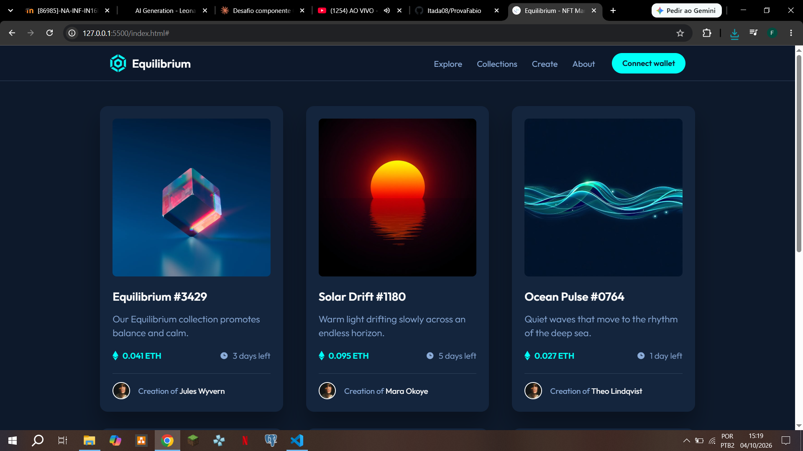
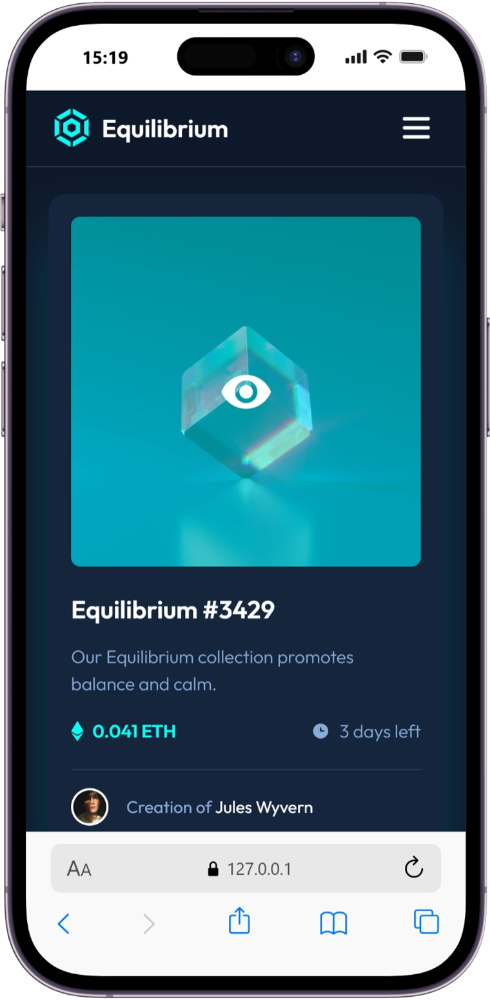

# Equilibrium - NFT Marketplace

Project built in 3 phases for the web development course.
A responsive page with an NFT card component, a list of cards with animations and a header.

## Live site
[Open the project](https://itada08.github.io/ProvaFabio/)

## Screenshots
| Desktop | Mobile |
|---|---|
|  |  |

## Phases
- **1.0 - Card NFT:** card based on the Frontend Mentor challenge, with hover effect.
- **1.1 - Card list:** several cards with different images and data, entrance animations.
- **1.2 - Header:** logo, navigation menu and a mobile menu.

## Technologies
- HTML5
- CSS3 (Grid, Flexbox, media queries, transitions)
- JavaScript (mobile menu)
- [Animate.style](https://animate.style/) for animations
- [Leonardo.ai](https://app.leonardo.ai/) for the generated images and logo
- Git and GitHub (branches per feature) and GitHub Pages

## Design
Based on the [NFT preview card](https://www.frontendmentor.io/challenges/nft-preview-card-component-SbdUL_w0U) challenge from Frontend Mentor.

## Author
**Itada08** - [GitHub](https://github.com/Itada08)